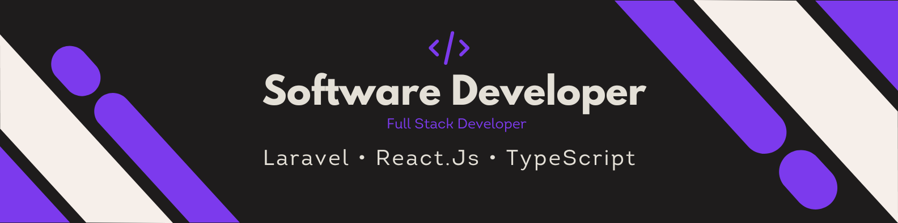

<div align="center">
  
</div>

<div align="center">
  <a href="https://git.io/typing-svg">
    
  </a>
</div>

<div align="center">
  <a href="https://joaoroblez.sparklab.dev.br" target="_blank">
    
  </a>
  <a href="mailto:joaoroblez76@gmail.com">
    
  </a>
  <a href="https://www.linkedin.com/in/joaoroblez">
    
  </a>
  <a href="https://wa.me/5514982136520">
    
  </a>
</div>

<div align="center">


</div>

---

# 👨‍💻 Sobre mim

Sou desenvolvedor Full Stack apaixonado por criar aplicações modernas, performáticas e bem estruturadas.

Atualmente trabalho com desenvolvimento de sistemas web utilizando **Laravel**, **React** e **TypeScript**, participando da evolução de aplicações institucionais e da modernização de sistemas legados.

Tenho grande interesse por arquitetura de software, APIs REST, automação de processos e Inteligência Artificial aplicada ao desenvolvimento.

---

## 🔥 Atualmente

🚀 Desenvolvendo aplicações em Laravel 12 + React

⚡ Modernizando sistemas legados

🤖 Estudando IA e Visão Computacional

📚 Aprimorando Arquitetura de Software

---

## ⚙️ Stack

### Back-End & IA


### Front-End


### Banco de Dados & Cloud


### Ferramentas


---

## 🚀 Projetos em Destaque

### 🔗 Desacoplamento Laravel 12 & React
Migração de portal monolítico para uma arquitetura desacoplada, com API RESTful conectada a uma SPA tipada.

**Stack:** `Laravel 12` `React` `TypeScript` `Postgres`
📎 [Repositório](https://github.com/jRoblxz)

---

### 🏢 TemperAndin / BarberFlow ERPs
Sistemas de gestão operacional e financeira com controle de estoque no PDV e dashboards analíticos.

**Destaques**
- Controle financeiro
- Controle de estoque
- Dashboard analítico
- PDV
- Relatórios

**Stack:** `React` `PHP` `MySQL` `Tailwind`
📎 [Repositório](https://github.com/jRoblxz/TemperAndin)

---

### 🤖 Sports Analytics Tracker (IA)
Pipeline de Visão Computacional utilizando redes neurais convolucionais (**YOLOv8** e **OpenCV**) em Python para mapeamento espacial de atletas em vídeo.

**Stack:** `Python` `OpenCV` `YOLO`
📎 [Repositório](https://github.com/jRoblxz/Sports-Analytics-Tracker)

---

### ⚡ N8N Automations & Workflows
Integração de webhooks e APIs externas para automação de rotinas fiscais e atendimento.

**Stack:** `Python` `N8N` `APIs`
📎 [Repositório](https://github.com/jRoblxz/Extrair_NotasFiscais)

---

## 🕒 Timeline

```text
2023 → ADS (início da graduação)
2024 → PHP • Laravel
2025 → React
2026 → Arquitetura de Software • IA
```

---

## 📊 Métricas de Produtividade & Código

<div align="center">
  
  
</div>
<div align="center">
  
</div>
<div align="center">
  
</div>

---

<div align="center">
  <sub>⭐ Obrigado por visitar meu perfil!<br/>Sempre aberto para conversar sobre tecnologia, desenvolvimento web e novos projetos.</sub>
</div>
